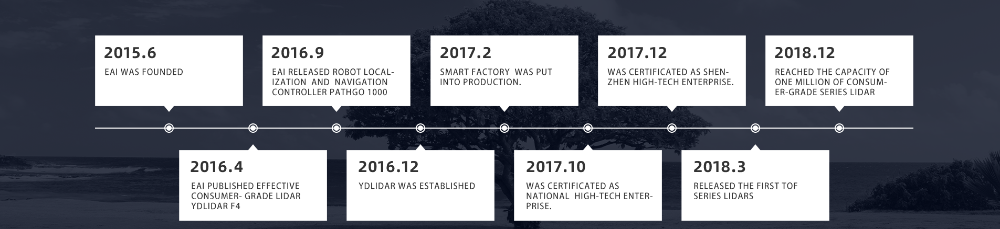

YDLIDAR S2-Pro SDK PACKAGE V1.0.0
=====================================================================

# Table of Contents

1. [Introduction](#introduction)
    - [Prerequisites](#prerequisites)

2. [Installation](#installation)
3. [Documents](#documents)
4. [Support](#support)
5. [Contact EAI](#contact-eai)

# Introduction

YDLidar S2-Pro SDK is the software development kit designed for YDLIDAR S2-Pro products. It is developed based on C++ following YDLidar S2-Pro SDK Communication Protocol, and provides easy-to-use C++,style API. With YDLidar S2-Pro SDK, users can quickly connect to YDLidar S2-Pro products and receive Laser scan data.

YDLidar S2-Pro SDK consists of YDLidar S2-Pro SDK communication protocol, YDLidar S2-Pro SDK core, YDLidar S2-Pro SDK API, Linux/windows samples.

### Prerequisites
* Linux
* Windows 7/10, Visual Studio 2015/2017
* C++11 compiler

## Installation

* [Fork and then Clone S2-Pro's GitHub code](https://github.com/YDLIDAR/S2-Pro) 

* [Build and Install](doc/howto/how_to_build_and_install.md) - This step is required,If you need to use it with ros, please switch to the intensity branch.

## Documents
* [LiDAR Dataset](doc/Dataset.md): All you need to know about LiDAR Models.

* [SDK FlowChart](doc/Diagram.md): Development flowchart.

* [YDLIDAR SDK API for Developers](doc/S2_Pro_SDK_API_for_Developers.md): All you need to know about S2-Pro API

* [HowTo](doc/howto/README.md): Brief technical solutions to common problems that developers face during the installation and use of the S2-Pro 

* [FAQs](doc/FAQs/README.md) 

## Support

You can get support from YDLidar with the following methods:
* Send email to support@ydlidar.com with a clear description of your problem and your setup
* Github Issues

## Contact EAI

If you have any extra questions, please feel free to [contact us](http://www.ydlidar.cn/cn/contact)

