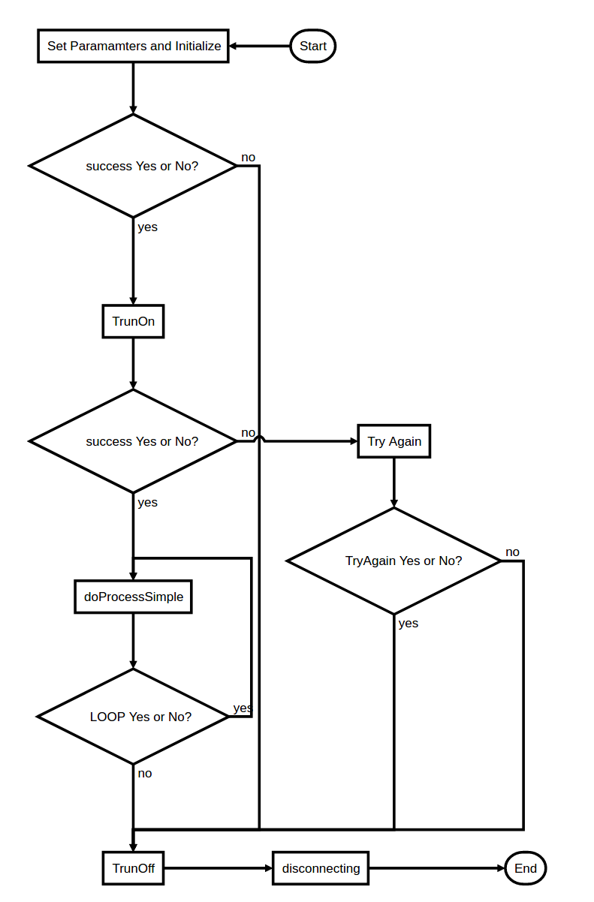

# S2-Pro SDK API for Developers


This document provides an extensive technical deep dive into how to create, manipulate and use YDLIDAR SDK's API.

## Table of Contents

- [Samples](#samples)
    - [Code Example](#code-example)
- [Development Flow](#development-flow)
- [C++ API Directory](#api-directory)
    - [CYdLidar](#cydlidar-api)
    - [YDlidarDriver](#ydlidardriver-api)
    - [Parameter Table](#parameter-table)

## Samples

The first part of demonstrating YDLIDAR S2-Pro SDK API is to understand the ydlidar_test/ydlidar_test example. Following are one optinal concepts:  `ydlidar::init(int argc, char *argv[])` (basic unit) of the example.

### Create A System State 

In the YDLIDAR S2-Pro SDK, the `ydlidar::init(int argc, char *argv[])` is optinal unit, If you need to accept `Ctrl + C` or other system abnormal signals. you can use it to create a system state, and check whether the system is normal by `ydlidar::ok()`.
The system signal creation interface is as follows:

```C
ydlidar::init(int argc, char *argv[]);
```

-  when `ydlidar::init(int argc, char *argv[])` has called, the system is in an initialized state, able to accept `Ctrl + C` and `ydlidar::shutdown()` signals.

### Code Example

#### S2-Pro LiDAR (../samples/ydlidar_test.cpp)

```C
#include "CYdLidar.h"
#include <iostream>
#include <string>
#include <algorithm>
#include <cctype>
using namespace std;
using namespace ydlidar;
#if defined(_MSC_VER)
#pragma comment(lib, "ydlidar_sdk.lib")
#endif

int main(int argc, char *argv[]) {
  // init system signal
  ydlidar::init(argc, argv);

  CYdLidar laser;
  //////////////////////string property/////////////////
  /// lidar port
  std::string port = "/dev/ydlidar
  laser.setlidaropt(LidarPropSerialPort, port.c_str(), port.size());
  /// ignore array
  std::string ignore_array;
  ignore_array.clear();
  laser.setlidaropt(LidarPropIgnoreArray, ignore_array.c_str(),
                    ignore_array.size());

  //////////////////////int property/////////////////
  /// lidar baudrate
  int optval = 115200;
  laser.setlidaropt(LidarPropSerialBaudrate, &optval, sizeof(int));
  /// abnormal count
  optval = 4;
  laser.setlidaropt(LidarPropAbnormalCheckCount, &optval, sizeof(int));

  //////////////////////bool property/////////////////
  /// fixed angle resolution
  bool b_optvalue = false;
  laser.setlidaropt(LidarPropFixedResolution, &b_optvalue, sizeof(bool));
  /// rotate 180
  laser.setlidaropt(LidarPropReversion, &b_optvalue, sizeof(bool));
  /// Counterclockwise
  laser.setlidaropt(LidarPropInverted, &b_optvalue, sizeof(bool));
  b_optvalue = true;
  laser.setlidaropt(LidarPropAutoReconnect, &b_optvalue, sizeof(bool));

  //////////////////////float property/////////////////
  /// unit: °
  float f_optvalue = 180.0f;
  laser.setlidaropt(LidarPropMaxAngle, &f_optvalue, sizeof(float));
  f_optvalue = -180.0f;
  laser.setlidaropt(LidarPropMinAngle, &f_optvalue, sizeof(float));
  /// unit: m
  f_optvalue = 16.f;
  laser.setlidaropt(LidarPropMaxRange, &f_optvalue, sizeof(float));
  f_optvalue = 0.1f;
  laser.setlidaropt(LidarPropMinRange, &f_optvalue, sizeof(float));
  /// unit: Hz
  f_optvalue = 10.f;
  laser.setlidaropt(LidarPropScanFrequency, &f_optvalue, sizeof(float));

  // initialize SDK and LiDAR
  bool ret = laser.initialize();
  if (ret) {//success
    //Start the device scanning routine which runs on a separate thread and enable motor.
    ret = laser.turnOn();
  } else {
    fprintf(stderr, "%s\n", laser.DescribeError());
    fflush(stderr);
  }

  LaserScan scan;
  // Turn On success and loop  
  while (ret && ydlidar::ok()) {
    bool hardError;
    scan.points.clear();

    if (laser.doProcessSimple(scan, hardError)) {
      fprintf(stdout, "Scan received[%llu]: %u ranges is [%f]Hz\n",
              scan.stamp,
              (unsigned int)scan.points.size(), 1.0 / scan.config.scan_time);
      fflush(stdout);
    } else {
      printf("[YDLIDAR ERROR]: %s\n",ydlidar::protocol::DescribeError(laser.getDriverError()));
      fflush(stdout);
    }
  }
  // Stop the device scanning thread and disable motor.
  laser.turnOff();
  // Uninitialize the SDK and Disconnect the LiDAR.
  laser.disconnecting();
  return 0;
}
```


#### CMake BUILD file(../samples/CMakeLists.txt)
```cmake
cmake_minimum_required(VERSION 2.8)
PROJECT(ydlidar_test)
set(CMAKE_CXX_FLAGS "${CMAKE_CXX_FLAGS} -std=c++11")
add_definitions(-std=c++11) # Use C++11

#Include directories
INCLUDE_DIRECTORIES(
     ${CMAKE_SOURCE_DIR}
     ${CMAKE_SOURCE_DIR}/../
     ${CMAKE_CURRENT_BINARY_DIR}
)

SET(EXECUTABLE_OUTPUT_PATH ${CMAKE_BINARY_DIR})
ADD_EXECUTABLE(${PROJECT_NAME}
               main.cpp)

# Add the required libraries for linking:
TARGET_LINK_LIBRARIES(${PROJECT_NAME} ydlidar_driver)
```
#### Build and Run
- Build: cd build & cmake ../ & make
- Run ydlidar_test in terminals:
	- ./ydlidar_test
- Examine the results: you should see message printing out in terminals.

## Development Flow

### FlowChart


### Sequence


## API Directory

### CYDLidar API
For additional information and examples, refer to [CYDLidar](#cydlidar)

### API List

#### C++ API

```C++
 /**
   * @brief set lidar properties
   * @param optname        option name
   * @todo string properties
   * - @ref LidarPropSerialPort
   * - @ref LidarPropIgnoreArray
   * @note set string property example
   * @code
   * CYdLidar laser;
   * std::string lidar_port = "/dev/ydlidar";
   * laser.setlidaropt(LidarPropSerialPort,lidar_port.c_str(), lidar_port.size());
   * @endcode
   * @todo int properties
   * - @ref LidarPropSerialBaudrate
   * - @ref LidarPropLidarType
   * - @ref LidarPropDeviceType
   * - @ref LidarPropSampleRate
   * @note set int property example
   * @code
   * CYdLidar laser;
   * int lidar_baudrate = 230400;
   * laser.setlidaropt(LidarPropSerialPort,&lidar_baudrate, sizeof(int));
   * @endcode
   * @todo bool properties
   * - @ref LidarPropFixedResolution
   * - @ref LidarPropReversion
   * - @ref LidarPropInverted
   * - @ref LidarPropAutoReconnect
   * - @ref LidarPropSingleChannel
   * - @ref LidarPropIntenstiy
   * @note set bool property example
   * @code
   * CYdLidar laser;
   * bool lidar_fixedresolution = true;
   * laser.setlidaropt(LidarPropSerialPort,&lidar_fixedresolution, sizeof(bool));
   * @endcode
   * @todo float properties
   * - @ref LidarPropMaxRange
   * - @ref LidarPropMinRange
   * - @ref LidarPropMaxAngle
   * - @ref LidarPropMinAngle
   * - @ref LidarPropScanFrequency
   * @note set float property example, Must be float type, not double type.
   * @code
   * CYdLidar laser;
   * float lidar_maxrange = 16.0f;
   * laser.setlidaropt(LidarPropSerialPort,&lidar_maxrange, sizeof(float));
   * @endcode
   * @param optval         option value
   * - std::string(or char*)
   * - int
   * - bool
   * - float
   * @param optlen         option length
   * - data type size
   * @return true if the Property is set successfully, otherwise false.
   * @see LidarProperty
   */
  bool setlidaropt(int optname, const void *optval, int optlen);

  /**
   * @brief get lidar property
   * @param optname         option name
   * @todo string properties
   * - @ref LidarPropSerialPort
   * - @ref LidarPropIgnoreArray
   * @note get string property example
   * @code
   * CYdLidar laser;
   * char lidar_port[30];
   * laser.getlidaropt(LidarPropSerialPort,lidar_port, sizeof(lidar_port));
   * @endcode
   * @todo int properties
   * - @ref LidarPropSerialBaudrate
   * - @ref LidarPropLidarType
   * - @ref LidarPropDeviceType
   * - @ref LidarPropSampleRate
   * @note get int property example
   * @code
   * CYdLidar laser;
   * int lidar_baudrate;
   * laser.getlidaropt(LidarPropSerialPort,&lidar_baudrate, sizeof(int));
   * @endcode
   * @todo bool properties
   * - @ref LidarPropFixedResolution
   * - @ref LidarPropReversion
   * - @ref LidarPropInverted
   * - @ref LidarPropAutoReconnect
   * - @ref LidarPropSingleChannel
   * - @ref LidarPropIntenstiy
   * @note get bool property example
   * @code
   * CYdLidar laser;
   * bool lidar_fixedresolution;
   * laser.getlidaropt(LidarPropSerialPort,&lidar_fixedresolution, sizeof(bool));
   * @endcode
   * @todo float properties
   * - @ref LidarPropMaxRange
   * - @ref LidarPropMinRange
   * - @ref LidarPropMaxAngle
   * - @ref LidarPropMinAngle
   * - @ref LidarPropScanFrequency
   * @note set float property example
   * @code
   * CYdLidar laser;
   * float lidar_maxrange;
   * laser.getlidaropt(LidarPropSerialPort,&lidar_maxrange, sizeof(float));
   * @endcode
   * @param optval          option value
   * - std::string(or char*)
   * - int
   * - bool
   * - float
   * @param optlen          option length
   * - data type size
   * @return true if the Property is get successfully, otherwise false.
   * @see LidarProperty
   */
  bool getlidaropt(int optname, void *optval, int optlen);

  /**
   * @brief Initialize the SDK and LiDAR.
   * @return true if successfully initialized, otherwise false.
   */
  bool initialize();

  /**
  * @brief Return LiDAR's version information in a numeric form.
  * @param version Pointer to a version structure for returning the version information.
  */
  void GetLidarVersion(LidarVersion &version);

  /**
   * @brief Start the device scanning routine which runs on a separate thread and enable motor.
   * @return true if successfully started, otherwise false.
   */
  bool  turnOn();  //!< See base class docs

  /**
   * @brief Get the LiDAR Scan Data. turnOn is successful before doProcessSimple scan data.
   * @param[out] outscan             LiDAR Scan Data
   * @param[out] hardwareError       hardware error status
   * @return true if successfully started, otherwise false.
   */
  bool doProcessSimple(LaserScan &scan_msg, bool &hardwareError);

  /**
   * @brief Stop the device scanning thread and disable motor.
   * @return true if successfully Stoped, otherwise false.
   */
  bool  turnOff(); //!< See base class docs

  /**
   * @brief Uninitialize the SDK and Disconnect the LiDAR.
   */
  void disconnecting(); //!< Closes the comms with the laser. Shouldn't have to be directly needed by the user


  /**
   * @brief Get the last error information of a (lidar or serial)
   * @return a human-readable description of the given error information
   * or the last error information of a (lidar or serial)
   */
  lidar_error_t getDriverError() const;

```


## YDlidarDriver API
For additional information and examples, refer to [YDlidarDriver](../src/ydlidar_driver.h)

### API List

```C
 /**
   * @brief Connecting Lidar \n
   * After the connection if successful, you must use ::disconnect to close
   * @param[in] port_path    serial port
   * @param[in] baudrate    serial baudrate，S2-Pro：
   *     115200
   * @return connection status
   * @retval 0     success
   * @retval < 0   failed
   * @note After the connection if successful, you must use ::disconnect to close
   * @see function ::YDlidarDriver::disconnect ()
   */
  result_t connect(const char *port_path, uint32_t baudrate);

  /*!
  * @brief Disconnect the LiDAR.
  */
  void disconnect();

  /**
  * @brief Get SDK Version \n
  * static function
  * @return Version
  */
  static std::string getSDKVersion();


  /**
   * @brief getDriverError
   * @return
   */
  lidar_error_t getDriverError();
  /**
   * @brief get Health status \n
   * @return result status
   * @retval RESULT_OK       success
   * @retval RESULT_FAILE or RESULT_TIMEOUT   failed
   */
  result_t getHealth(device_health &health, uint32_t timeout = DEFAULT_TIMEOUT);

  /**
   * @brief get Device information \n
   * @param[in] info     Device information
   * @param[in] timeout  timeout
   * @return result status
   * @retval RESULT_OK       success
   * @retval RESULT_FAILE or RESULT_TIMEOUT   failed
   */
  result_t getDeviceInfo(device_info &info, uint32_t timeout = DEFAULT_TIMEOUT);

  /**
   * @brief Get lidar scan frequency \n
   * @param[in] frequency    scanning frequency
   * @param[in] timeout      timeout
   * @return return status
   * @retval RESULT_OK       success
   * @retval RESULT_FAILE    failed
   * @note Non-scan state, perform currect operation.
   */
  result_t getScanFrequency(scan_frequency_t &frequency,
                            uint32_t timeout = DEFAULT_TIMEOUT);

  /**
   * @brief Increase the scanning frequency by 1.0 HZ \n
   * @param[in] frequency    scanning frequency
   * @param[in] timeout      timeout
   * @return return status
   * @retval RESULT_OK       success
   * @retval RESULT_FAILE    failed
   * @note Non-scan state, perform currect operation.
   */
  result_t setScanFrequencyAdd(scan_frequency_t &frequency,
                               uint32_t timeout = DEFAULT_TIMEOUT);

  /**
   * @brief Reduce the scanning frequency by 1.0 HZ \n
   * @param[in] frequency    scanning frequency
   * @param[in] timeout      timeout
   * @return return status
   * @retval RESULT_OK       success
   * @retval RESULT_FAILE    failed
   * @note Non-scan state, perform currect operation.
   */
  result_t setScanFrequencyDis(scan_frequency_t &frequency,
                               uint32_t timeout = DEFAULT_TIMEOUT);

  /**
   * @brief Increase the scanning frequency by 0.1 HZ \n
   * @param[in] frequency    scanning frequency
   * @param[in] timeout      timeout
   * @return return status
   * @retval RESULT_OK       success
   * @retval RESULT_FAILE    failed
   * @note Non-scan state, perform currect operation.
   */
  result_t setScanFrequencyAddMic(scan_frequency_t &frequency,
                                  uint32_t timeout = DEFAULT_TIMEOUT);

  /**
   * @brief Reduce the scanning frequency by 0.1 HZ \n
   * @param[in] frequency    scanning frequency
   * @param[in] timeout      timeout
   * @return return status
   * @retval RESULT_OK       success
   * @retval RESULT_FAILE    failed
   * @note Non-scan state, perform currect operation.
   */
  result_t setScanFrequencyDisMic(scan_frequency_t &frequency,
                                  uint32_t timeout = DEFAULT_TIMEOUT);

  /**
   * @brief fetches zero angle tolerance values from lidar’s internal memory while lidar assembly \n
   * @param[in] angle　　　   zero offset angle
   * @param[in] timeout      timeout
   * @return return status
   * @retval RESULT_OK       success
   * @retval RESULT_TIMEOUT  Failed
   * @retval RESULT_FAILE    Angle is not calibrated
   * @note Non-scan state, perform currect operation.
   */
  result_t getZeroOffsetAngle(offset_angle_t &angle,
                              uint32_t timeout =  DEFAULT_TIMEOUT);

  /**
    * @brief lidarPortList Get Lidar Port lists
    * @return online lidars
    */
  static std::map<std::string, std::string> lidarPortList();

  /**
   * @brief Is it connected to the lidar \n
   * @return connection status
   * @retval true     connected
   * @retval false    Non-connected
   */
  bool isConnected() const;

  /**
   * @brief Is the Lidar in the scan \n
   * @return scanning status
   * @retval true     scanning
   * @retval false    non-scanning
   */
  bool isScanning() const;

  /**
   * @brief getPointTime
   * @return
   */
  uint32_t getPointIntervalTime() const;

  /**
   * @brief getPackageTime
   * @return
   */
  uint32_t getPackageTransferTime() const;

  /**
   * @brief whether to support hot plug \n
   * @param[in] enable    hot plug :
   *   true	support
   *   false no support
   */
  void setAutoReconnect(const bool &enable);

  /**
   * @brief setSingleChannel
   * @param enable
   */
  void setSingleChannel(bool enable);

  /**
   * @brief Turn on scanning \n
   * @param[in] force    Scan mode
   * @param[in] timeout  timeout
   * @return result status
   * @retval RESULT_OK       success
   * @retval RESULT_FAILE    failed
   * @note Just turn it on once
   */
  result_t startScan(uint32_t timeout = DEFAULT_TIMEOUT) ;

  /*!
   * @brief stop Scanning state
   * @param timeout  timeout
   * @return status
   * @retval RESULT_OK       success
   * @retval RESULT_FAILE    failed
   */
  result_t stopScan(uint32_t timeout = DEFAULT_TIMEOUT);


  /**
   * @brief turn off scanning \n
   * @return result status
   * @retval RESULT_OK       success
   * @retval RESULT_FAILE    failed
   */
  result_t stop();


  /**
   * @brief Get a circle of laser data \n
   * @param[in] fan        Laser data
   * @param[in] count      one circle of laser points
   * @param[in] timeout    timeout
   * @return return status
   * @retval RESULT_OK       success
   * @retval RESULT_FAILE    failed
   * @note Before starting, you must start the start the scan successfully with the ::startScan function
   */
  result_t grabScanData(LaserFan *fan, uint32_t timeout = DEFAULT_TIMEOUT) ;

  /**
   * @brief start motor \n
   * @return return status
   * @retval RESULT_OK       success
   * @retval RESULT_FAILE    failed
   */
  result_t startMotor();

  /**
   * @brief stop motor \n
   * @return return status
   * @retval RESULT_OK       success
   * @retval RESULT_FAILE    failed
   */
  result_t stopMotor();

  /**
   * @brief flush
   */
  void flush();
```


## Parameter Table

The Table that the user uses to perform parameter related operations:

- Set the parameter related API by table.

For additional information and examples, refer to [Parameter](#code-example)

### Table List - Models
|LIDAR      | Model  |  Baudrate |  SampleRate(K) | Range(m)  		   |  Frequency(HZ) | Intenstiy(bit) | SingleChannel | voltage(V)|
| :-------- |:--:|:--:|:--:|:--:|:--:|:--:|:--:|:--:|
| S2-Pro    | 4	   |  115200   |   3            |  0.12~8.0        | 5~8            | false          | false    	  | 4.8~5.2   |


