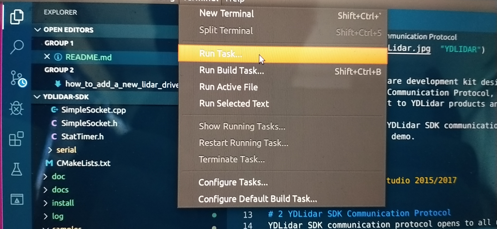
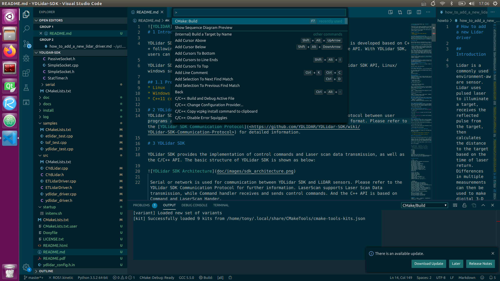

# How to Build and Debug using VSCode

Visual Studio Code (hereafter referred to as VSCode) is Microsoft's first lightweight code editor for Linux. Find below a few configuration files that allow the use of VSCode to compile and debug the S2-Pro project. I will elaborate on it below, hoping to bring some help to the developers.

## Compile the S2-Pro project using VSCode

You could first set up the S2-Pro project using the [build and release](how_to_build_and_release.md) document under **Build in Visual Studio Code**. Only follow the steps until the `Build the S2-Pro Project in VSCode title`

In the pop-up window, select the corresponding The options are as shown below:

