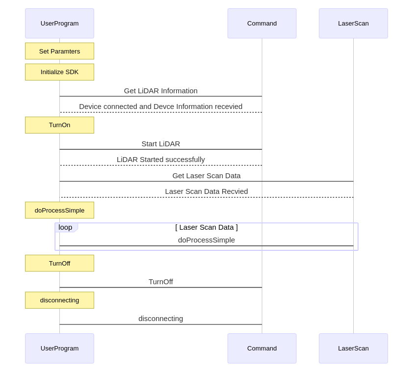
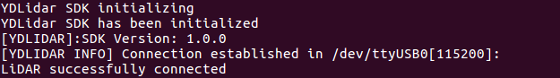
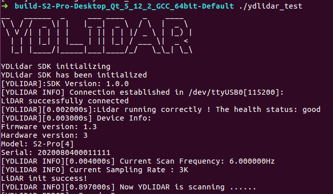

# How to Build and Install

* [1. Install CMake](#install-camke)
* [2. Build S2-Pro](#build-s2-pro)
* [3. Run Samples](#run-s2-pro-sample)
* [4. Build in VSCode](#build-in-visual-studio-code)

## Install CMake
The installation procedures in Ubuntu 18.04/16.04/14.04 LTS and Windows 7/10 are shown here as examples. For Ubuntu 18.04/16.04/14.04 32-bit LTS and Mac, you can get it in [S2-Pro wiki](https://github.com/YDLIDAR/S2-Pro/wiki).
S2-Pro requires [CMake 2.8.2+](https://cmake.org/) as dependencies. 
### Ubuntu 18.04/16.04/14.04 LTS
You can install these packages using apt:
```shell
sudo apt install cmake pkg-config
```
### Windows 7/10
[vcpkg](https://github.com/Microsoft/vcpkg) is recommended for building the dependency libraries as follows:
For the 32-bit project:
```
.\vcpkg install cmake
.\vcpkg integrate install
```
For the 64-bit project:
```
.\vcpkg install cmake:x64-windows
.\vcpkg integrate install
```

## Build S2-Pro
### Ubuntu 18.04/16.04/14.04 LTS
In the YDLidar S2-Pro SDK directory, run the following commands to compile the project:
```
git clone https://github.com/YDLIDAR/S2-Pro.git
cd S2-Pro/build
cmake ..
make
```

### Windows 7/10
Then, in the YDLidar S2-Pro SDK directory, run the following commands to create the Visual Studio solution file. Please replace [vcpkgroot] with your vcpkg installation path.
Generate the 32-bit project:
```
cd build && \
cmake .. "-DCMAKE_TOOLCHAIN_FILE=[vcpkgroot]\scripts\buildsystems\vcpkg.cmake"
```
Generate the 64-bit project:
```
cd build && \
cmake .. -G "Visual Studio 15 2017 Win64" "-DCMAKE_TOOLCHAIN_FILE=[vcpkgroot]\scripts\buildsystems\vcpkg.cmake"
```

#### Compile S2-Pro
You can now compile the YDLidar SDK in Visual Studio.
Note: 
* For more windows build and Run, Please refer to [How to gerenrate Vs Project by CMake](how_to_gerenrate_vs_project_by_cmake.md)
* For VS2017 or higher, Please refer to [CMake projects in visual studio](https://docs.microsoft.com/zh-cn/cpp/build/cmake-projects-in-visual-studio?view=vs-2019)


## Run S2-Pro Sample
Three samples are provided in samples, which demonstrate how to configure YDLidar LiDAR units and receive the laser scan data when directly connecting YDLidar S2-Pro SDK to LiDAR units or by using a YDLidar Adapter board, respectively. The sequence diagram is shown as below:



### Ubuntu 18.04/16.04 /14.04 LTS
For Ubuntun 18.04/16.04/14.04 LTS, run the *ydlidar_test* if connect with the Triangle LiDAR unit(s) or TOF LiDAR unit(s):
```
./ydlidar_test
```
### Windows 7/10
After compiling the YDLidar SDK as shown in section 4.1.2, you can find `ydlidar_test.exe` in the {S2-Pro}\build\Debug or {S2-Pro}\build\Release folder, respectively, which can be run directly.

Then you can see SDK initializing the information as below:



Then you can see SDK Scanning the information as below:




## Build in Visual Studio Code
### Install VSCode
The easiest way to install for Debian/Ubuntu based distributions is to download from  https://code.visualstudio.com and install the .deb package (64-bit) either through the graphical software center if it's available or through the command line with:
```bash
sudo dpkg -i <file>.deb
sudo apt-get install -f # Install dependencies
```
### Start VSCode
Start VSCode with the following command: 
```bash
code
```
### Open the S2-Pro project in VSCode
Use the keyboard shortcut **(Ctrl+K Ctrl+O)** to open the S2-Pro project. 
### Build the S2-Pro project in VSCode
Use the keyboard shortcut **(Ctrl+Shift+B)** to build the S2-Pro project. 
### Run all unit tests for the S2-Pro project in VSCode
Select the "Tasks->Run Tasks..." menu command and click "run all unit tests for the S2-Pro project" from a popup menu to check the code style for the S2-Pro project. 

### Run a code style check task for the S2-Pro project in VSCode
Select the "Tasks->Run Tasks..." menu command and click "code style check for the S2-Pro project" from a popup menu to check the code style for the S2-Pro project. 
### Clean the S2-Pro project in VSCode
Select the "Tasks->Run Tasks..." menu command and click "clean the S2-Pro project" from a popup menu to clean the S2-Pro project. 
